# 🗳️ Digital Nirbachon 2026

<div align="center">

# <span class="glitch" data-text="Secure">Secure</span> <span class="gradient">Bangladesh Election</span> <span class="typing">Voting System</span>

[](https://opensource.org/licenses/MIT)
[](https://reactjs.org/)
[](https://nodejs.org/)
[](https://www.mongodb.com/)

</div>

---

## 🎯 What is Digital Nirbachon 2026?

**Digital Nirbachon 2026** is a cutting-edge digital voting platform designed specifically for Bangladesh's 2026 elections. Our system revolutionizes traditional voting by providing a secure, transparent, and accessible way for citizens to participate in the democratic process.

### ✨ Key Features

<div class="feature-grid">

<div class="feature-card">
  <div class="feature-icon">🔐</div>
  <h3>Enhanced Security</h3>
  <p>Multi-layer security with Firebase authentication and device fingerprinting</p>
</div>

<div class="feature-card">
  <div class="feature-icon">📱</div>
  <h3>Mobile Responsive</h3>
  <p>Seamless voting experience across all devices and screen sizes</p>
</div>

<div class="feature-card">
  <div class="feature-icon">⚡</div>
  <h3>Real-time Results</h3>
  <p>Instant vote counting and live election result updates</p>
</div>

<div class="feature-card">
  <div class="feature-icon">🛡️</div>
  <h3>Anti-Fraud Protection</h3>
  <p>Advanced algorithms to prevent duplicate votes and fraudulent activities</p>
</div>

</div>

---

## 🛠️ Technology Stack

Our platform leverages modern technologies to ensure reliability, scalability, and security:

<div class="tech-stack">

### Frontend Stack
<div class="tech-item">
  <span class="tech-icon">⚛️</span>
  <div class="tech-details">
    <h4>React 18.3.1</h4>
    <p>Modern UI library with hooks and functional components</p>
  </div>
</div>

<div class="tech-item">
  <span class="tech-icon">📘</span>
  <div class="tech-details">
    <h4>TypeScript 5.x</h4>
    <p>Type-safe development for enhanced code quality</p>
  </div>
</div>

<div class="tech-item">
  <span class="tech-icon">⚡</span>
  <div class="tech-details">
    <h4>Vite 5.x</h4>
    <p>Lightning-fast build tool and development server</p>
  </div>
</div>

### Backend Stack
<div class="tech-item">
  <span class="tech-icon">🟢</span>
  <div class="tech-details">
    <h4>Node.js 20.x</h4>
    <p>Robust JavaScript runtime for server-side development</p>
  </div>
</div>

<div class="tech-item">
  <span class="tech-icon">🚀</span>
  <div class="tech-details">
    <h4>Express.js</h4>
    <p>Minimalist web framework for API development</p>
  </div>
</div>

<div class="tech-item">
  <span class="tech-icon">🍃</span>
  <div class="tech-details">
    <h4>MongoDB 7.x</h4>
    <p>NoSQL database for flexible data storage</p>
  </div>
</div>

### Security & Authentication
<div class="tech-item">
  <span class="tech-icon">🔥</span>
  <div class="tech-details">
    <h4>Firebase Auth</h4>
    <p>Secure user authentication and session management</p>
  </div>
</div>

<div class="tech-item">
  <span class="tech-icon">🔑</span>
  <div class="tech-details">
    <h4>JWT Tokens</h4>
    <p>Stateless authentication for API security</p>
  </div>
</div>

</div>

---

## 🏗️ Architecture Overview

```mermaid
graph TD
    A[👤 User] -->|Firebase Auth| B[⚛️ React Frontend]
    B --> C[🚀 Express API]
    C --> D[🍃 MongoDB]
    C --> E[🔥 Firebase Services]
    C --> F[🛡️ Security Layer]
    F --> G[📊 Vote Processing]
    G --> H[📈 Real-time Results]
```



---

## 🎨 Project Highlights

<div class="highlights">

<div class="highlight-item">
  <h3>🎯 Mission</h3>
  <p>To modernize Bangladesh's electoral process through technology while maintaining the highest standards of security and transparency.</p>
</div>

<div class="highlight-item">
  <h3>🌟 Vision</h3>
  <p>Creating an inclusive digital democracy where every citizen can exercise their right to vote conveniently and securely.</p>
</div>

<div class="highlight-item">
  <h3>🚀 Innovation</h3>
  <p>Leveraging cutting-edge web technologies to build a scalable, secure, and user-friendly voting platform.</p>
</div>

</div>

---

## 📊 Project Statistics

<div class="stats">
  <div class="stat-item">
    <h3 class="stat-number" data-target="100">0</h3>
    <p>Security Layers</p>
  </div>
  <div class="stat-item">
    <h3 class="stat-number" data-target="99.9">0</h3>
    <p>Uptime %</p>
  </div>
  <div class="stat-item">
    <h3 class="stat-number" data-target="24">0</h3>
    <p>Real-time Updates</p>
  </div>
  <div class="stat-item">
    <h3 class="stat-number" data-target="165">0</h3>
    <p>Million Citizens</p>
  </div>
</div>

---

## 🗂️ Project Structure

```
📦 Digital Nirbachon 2026
├── 📁 frontend/                 # React TypeScript application
│   ├── 📁 components/           # Reusable UI components
│   ├── 📁 config/              # Configuration files
│   └── 📁 types/               # TypeScript definitions
├── 📁 backend/                 # Node.js Express API
│   ├── 📁 controllers/         # Request handlers
│   ├── 📁 models/              # Database models
│   ├── 📁 routes/              # API routes
│   ├── 📁 services/            # Business logic
│   └── 📁 utils/               # Utility functions
└── 📁 shared/                  # Shared utilities
```

---

## 🎉 Acknowledgments

<div class="acknowledgments">
  <p>This project represents a collaborative effort to advance democratic participation through technology. We acknowledge the support of the development community and the trust placed in us to build a secure voting system for Bangladesh.</p>
  
  <div class="team">
    <h4>👥 Development Team</h4>
    <p>Digital Nirbachon 2026 Development Team</p>
  </div>
</div>

---

<div align="center">

## <span class="pulse">Made with ❤️ for Bangladesh</span>

[](https://vercel.com)
[](https://render.com)

</div>

<style>
/* Global Styles */
* {
  margin: 0;
  padding: 0;
  box-sizing: border-box;
}

/* Glitch Effect */
.glitch {
  position: relative;
  color: #fff;
  font-size: 2.5rem;
  font-weight: bold;
  letter-spacing: 0.5em;
  animation: glitch-skew 1s infinite linear alternate-reverse;
}

.glitch::before,
.glitch::after {
  content: attr(data-text);
  position: absolute;
  top: 0;
  left: 0;
  width: 100%;
  height: 100%;
}

.glitch::before {
  animation: glitch-anim-1 0.5s infinite linear alternate-reverse;
  color: #ff0000;
  z-index: -1;
}

.glitch::after {
  animation: glitch-anim-2 0.5s infinite linear alternate-reverse;
  color: #00ffff;
  z-index: -2;
}

@keyframes glitch-anim-1 {
  0% { clip-path: inset(40% 0 61% 0); }
  20% { clip-path: inset(92% 0 1% 0); }
  40% { clip-path: inset(43% 0 1% 0); }
  60% { clip-path: inset(25% 0 58% 0); }
  80% { clip-path: inset(54% 0 7% 0); }
  100% { clip-path: inset(58% 0 43% 0); }
}

@keyframes glitch-anim-2 {
  0% { clip-path: inset(25% 0 58% 0); }
  20% { clip-path: inset(54% 0 7% 0); }
  40% { clip-path: inset(58% 0 43% 0); }
  60% { clip-path: inset(40% 0 61% 0); }
  80% { clip-path: inset(92% 0 1% 0); }
  100% { clip-path: inset(43% 0 1% 0); }
}

@keyframes glitch-skew {
  0% { transform: skew(0deg); }
  20% { transform: skew(-2deg); }
  40% { transform: skew(0deg); }
  60% { transform: skew(1deg); }
  80% { transform: skew(0deg); }
  100% { transform: skew(0deg); }
}

/* Gradient Text */
.gradient {
  background: linear-gradient(45deg, #ff6b6b, #4ecdc4, #45b7d1, #96ceb4, #ffeaa7);
  background-size: 300% 300%;
  -webkit-background-clip: text;
  background-clip: text;
  -webkit-text-fill-color: transparent;
  animation: gradient-shift 3s ease infinite;
}

@keyframes gradient-shift {
  0% { background-position: 0% 50%; }
  50% { background-position: 100% 50%; }
  100% { background-position: 0% 50%; }
}

/* Typing Effect */
.typing {
  overflow: hidden;
  border-right: 3px solid #00ffff;
  white-space: nowrap;
  animation: typing 3.5s steps(40, end), blink-caret 0.75s step-end infinite;
}

@keyframes typing {
  from { width: 0; }
  to { width: 100%; }
}

@keyframes blink-caret {
  from, to { border-color: transparent; }
  50% { border-color: #00ffff; }
}

/* Feature Grid */
.feature-grid {
  display: grid;
  grid-template-columns: repeat(auto-fit, minmax(250px, 1fr));
  gap: 1.5rem;
  margin: 2rem 0;
}

.feature-card {
  background: linear-gradient(135deg, rgba(255,255,255,0.1), rgba(255,255,255,0.05));
  border: 1px solid rgba(255,255,255,0.2);
  border-radius: 15px;
  padding: 1.5rem;
  text-align: center;
  transition: all 0.3s ease;
  backdrop-filter: blur(10px);
}

.feature-card:hover {
  transform: translateY(-10px);
  box-shadow: 0 20px 40px rgba(0,0,0,0.3);
  border-color: #4ecdc4;
}

.feature-icon {
  font-size: 2.5rem;
  margin-bottom: 1rem;
}

/* Tech Stack */
.tech-stack {
  margin: 2rem 0;
}

.tech-item {
  display: flex;
  align-items: center;
  margin: 1rem 0;
  padding: 1rem;
  background: rgba(255,255,255,0.05);
  border-radius: 10px;
  transition: all 0.3s ease;
}

.tech-item:hover {
  background: rgba(255,255,255,0.1);
  transform: translateX(10px);
}

.tech-icon {
  font-size: 2rem;
  margin-right: 1rem;
  min-width: 60px;
}

.tech-details h4 {
  color: #4ecdc4;
  margin-bottom: 0.5rem;
}

/* Stats */
.stats {
  display: grid;
  grid-template-columns: repeat(auto-fit, minmax(200px, 1fr));
  gap: 2rem;
  margin: 2rem 0;
}

.stat-item {
  text-align: center;
  padding: 1.5rem;
  background: linear-gradient(135deg, rgba(78,205,196,0.1), rgba(255,107,107,0.1));
  border-radius: 15px;
  border: 1px solid rgba(78,205,196,0.3);
}

.stat-number {
  font-size: 3rem;
  font-weight: bold;
  color: #4ecdc4;
  margin-bottom: 0.5rem;
}

/* Highlights */
.highlights {
  display: grid;
  grid-template-columns: repeat(auto-fit, minmax(300px, 1fr));
  gap: 2rem;
  margin: 2rem 0;
}

.highlight-item {
  padding: 1.5rem;
  background: linear-gradient(135deg, rgba(69,183,209,0.1), rgba(150,206,180,0.1));
  border-radius: 15px;
  border-left: 4px solid #45b7d1;
}

.highlight-item h3 {
  color: #45b7d1;
  margin-bottom: 1rem;
}

/* Pulse Animation */
.pulse {
  animation: pulse 2s infinite;
}

@keyframes pulse {
  0% { transform: scale(1); }
  50% { transform: scale(1.05); }
  100% { transform: scale(1); }
}

/* Responsive Design */
@media (max-width: 768px) {
  .glitch {
    font-size: 1.8rem;
  }
  
  .feature-grid,
  .stats,
  .highlights {
    grid-template-columns: 1fr;
  }
  
  .tech-item {
    flex-direction: column;
    text-align: center;
  }
  
  .tech-icon {
    margin-right: 0;
    margin-bottom: 1rem;
  }
}

/* Smooth Scrolling */
html {
  scroll-behavior: smooth;
}

/* Custom Scrollbar */
::-webkit-scrollbar {
  width: 8px;
}

::-webkit-scrollbar-track {
  background: rgba(255,255,255,0.1);
}

::-webkit-scrollbar-thumb {
  background: linear-gradient(45deg, #4ecdc4, #45b7d1);
  border-radius: 4px;
}

::-webkit-scrollbar-thumb:hover {
  background: linear-gradient(45deg, #45b7d1, #4ecdc4);
}
</style>

<script>
// Stats Counter Animation
function animateStats() {
  const stats = document.querySelectorAll('.stat-number');
  stats.forEach(stat => {
    const target = parseInt(stat.getAttribute('data-target'));
    const increment = target / 100;
    let current = 0;
    
    const timer = setInterval(() => {
      current += increment;
      if (current >= target) {
        current = target;
        clearInterval(timer);
      }
      stat.textContent = Math.floor(current);
    }, 20);
  });
}

// Intersection Observer for animations
const observerOptions = {
  threshold: 0.1,
  rootMargin: '0px 0px -50px 0px'
};

const observer = new IntersectionObserver((entries) => {
  entries.forEach(entry => {
    if (entry.isIntersecting) {
      if (entry.target.classList.contains('stats')) {
        animateStats();
      }
      entry.target.style.opacity = '1';
      entry.target.style.transform = 'translateY(0)';
    }
  });
}, observerOptions);

// Initialize animations when page loads
document.addEventListener('DOMContentLoaded', () => {
  // Observe stats section
  const statsSection = document.querySelector('.stats');
  if (statsSection) {
    observer.observe(statsSection);
  }
  
  // Add staggered animations to feature cards
  const featureCards = document.querySelectorAll('.feature-card');
  featureCards.forEach((card, index) => {
    card.style.opacity = '0';
    card.style.transform = 'translateY(20px)';
    card.style.transition = `all 0.6s ease ${index * 0.1}s`;
    observer.observe(card);
  });
  
  // Add staggered animations to tech items
  const techItems = document.querySelectorAll('.tech-item');
  techItems.forEach((item, index) => {
    item.style.opacity = '0';
    item.style.transform = 'translateX(-20px)';
    item.style.transition = `all 0.6s ease ${index * 0.1}s`;
    observer.observe(item);
  });
});
</script>