# 🗳️ Digital Nirbachon 2026

<div align="center">

# <span class="glitch" data-text="Secure">Secure</span> <span class="gradient">Bangladesh Election</span> <span class="typing">Voting System</span>

[](https://opensource.org/licenses/MIT)
[](https://reactjs.org/)
[](https://nodejs.org/)
[](https://www.mongodb.com/)

</div>

---

## 🎯 What is Digital Nirbachon 2026?

**Digital Nirbachon 2026** is a cutting-edge digital voting platform designed specifically for Bangladesh's 2026 elections. Our system revolutionizes traditional voting by providing a secure, transparent, and accessible way for citizens to participate in the democratic process.

### ✨ Key Features

<div class="feature-grid">

<div class="feature-card">
  <div class="feature-icon">🔐</div>
  <h3>Enhanced Security</h3>
  <p>Multi-layer security with Firebase authentication and device fingerprinting</p>
</div>

<div class="feature-card">
  <div class="feature-icon">📱</div>
  <h3>Mobile Responsive</h3>
  <p>Seamless voting experience across all devices and screen sizes</p>
</div>

<div class="feature-card">
  <div class="feature-icon">⚡</div>
  <h3>Real-time Results</h3>
  <p>Instant vote counting and live election result updates</p>
</div>

<div class="feature-card">
  <div class="feature-icon">🛡️</div>
  <h3>Anti-Fraud Protection</h3>
  <p>Advanced algorithms to prevent duplicate votes and fraudulent activities</p>
</div>

</div>

---

## 🛠️ Technology Stack

Our platform leverages modern technologies to ensure reliability, scalability, and security:

<div class="tech-stack">

### Frontend Stack
<div class="tech-item">
  <span class="tech-icon">⚛️</span>
  <div class="tech-details">
    <h4>React 18.3.1</h4>
    <p>Modern UI library with hooks and functional components</p>
  </div>
</div>

<div class="tech-item">
  <span class="tech-icon">📘</span>
  <div class="tech-details">
    <h4>TypeScript 5.x</h4>
    <p>Type-safe development for enhanced code quality</p>
  </div>
</div>

<div class="tech-item">
  <span class="tech-icon">⚡</span>
  <div class="tech-details">
    <h4>Vite 5.x</h4>
    <p>Lightning-fast build tool and development server</p>
  </div>
</div>

### Backend Stack
<div class="tech-item">
  <span class="tech-icon">🟢</span>
  <div class="tech-details">
    <h4>Node.js 20.x</h4>
    <p>Robust JavaScript runtime for server-side development</p>
  </div>
</div>

<div class="tech-item">
  <span class="tech-icon">🚀</span>
  <div class="tech-details">
    <h4>Express.js</h4>
    <p>Minimalist web framework for API development</p>
  </div>
</div>

<div class="tech-item">
  <span class="tech-icon">🍃</span>
  <div class="tech-details">
    <h4>MongoDB 7.x</h4>
    <p>NoSQL database for flexible data storage</p>
  </div>
</div>

### Security & Authentication
<div class="tech-item">
  <span class="tech-icon">🔥</span>
  <div class="tech-details">
    <h4>Firebase Auth</h4>
    <p>Secure user authentication and session management</p>
  </div>
</div>

<div class="tech-item">
  <span class="tech-icon">🔑</span>
  <div class="tech-details">
    <h4>JWT Tokens</h4>
    <p>Stateless authentication for API security</p>
  </div>
</div>

</div>

---

## 🏗️ Architecture Overview

```mermaid
graph TD
    A[👤 User] -->|Firebase Auth| B[⚛️ React Frontend]
    B --> C[🚀 Express API]
    C --> D[🍃 MongoDB]
    C --> E[🔥 Firebase Services]
    C --> F[🛡️ Security Layer]
    F --> G[📊 Vote Processing]
    G --> H[📈 Real-time Results]
```



---

## 🎨 Project Highlights

<div class="highlights">

<div class="highlight-item">
  <h3>🎯 Mission</h3>
  <p>To modernize Bangladesh's electoral process through technology while maintaining the highest standards of security and transparency.</p>
</div>

<div class="highlight-item">
  <h3>🌟 Vision</h3>
  <p>Creating an inclusive digital democracy where every citizen can exercise their right to vote conveniently and securely.</p>
</div>

<div class="highlight-item">
  <h3>🚀 Innovation</h3>
  <p>Leveraging cutting-edge web technologies to build a scalable, secure, and user-friendly voting platform.</p>
</div>

</div>

---

## 📊 Project Statistics

<div class="stats">
  <div class="stat-item">
    <h3 class="stat-number" data-target="100">0</h3>
    <p>Security Layers</p>
  </div>
  <div class="stat-item">
    <h3 class="stat-number" data-target="99.9">0</h3>
    <p>Uptime %</p>
  </div>
  <div class="stat-item">
    <h3 class="stat-number" data-target="24">0</h3>
    <p>Real-time Updates</p>
  </div>
  <div class="stat-item">
    <h3 class="stat-number" data-target="165">0</h3>
    <p>Million Citizens</p>
  </div>
</div>

---

## 🗂️ Project Structure

```
📦 Digital Nirbachon 2026
├── 📁 frontend/                 # React TypeScript application
│   ├── 📁 components/           # Reusable UI components
│   ├── 📁 config/              # Configuration files
│   └── 📁 types/               # TypeScript definitions
├── 📁 backend/                 # Node.js Express API
│   ├── 📁 controllers/         # Request handlers
│   ├── 📁 models/              # Database models
│   ├── 📁 routes/              # API routes
│   ├── 📁 services/            # Business logic
│   └── 📁 utils/               # Utility functions
└── 📁 shared/                  # Shared utilities
```

---

## 🎉 Acknowledgments

<div class="acknowledgments">
  <p>This project represents a collaborative effort to advance democratic participation through technology. We acknowledge the support of the development community and the trust placed in us to build a secure voting system for Bangladesh.</p>
  
  <div class="team">
    <h4>👥 Development Team</h4>
    <p>Digital Nirbachon 2026 Development Team</p>
  </div>
</div>

---

<div align="center">

## <span class="pulse">Made with ❤️ for Bangladesh</span>

[](https://vercel.com)
[](https://render.com)

</div>
